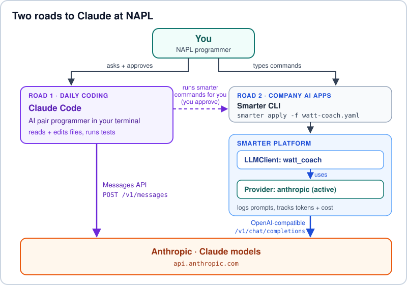
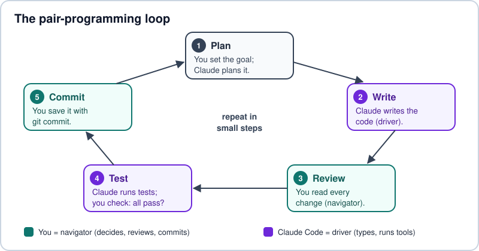

Getting Started: Pair Programming with Claude Code and Smarter
==============================================================

**Who this is for:** programmers in the NAPL custom programming area.
**Time:** about 45 minutes.

Welcome! At Northern Aurora Power & Light (NAPL), every programmer gets a
virtual coding partner. Your partner is **Claude Code**, an AI tool that
works in your terminal. NAPL's company AI platform, **Smarter**, gives every
team safe access to the same Claude models. This tutorial shows how the two
work together.

.. contents:: On this page
   :local:
   :depth: 1

Goal
----

**We will use Claude Code with Smarter to build "Watt Watcher", a tiny Python
tool that tells you how much electricity a device uses and what it costs.
Then we will launch "Watt Coach", a Claude-powered helper on Smarter that
answers the same question in plain words.**

You will finish with three things:

1. ``watt_watcher.py`` and its tests, written with Claude Code as your pair.
2. ``watt_coach``, a Smarter LLMClient that runs on NAPL's Anthropic Provider.
3. Proof that the program and the AI helper give the same answer.

.. admonition:: The math we will teach the computer

   A game console uses 200 watts. You play for 3 hours.

   - Energy: 200 watts x 3 hours = 600 watt-hours = **0.6 kWh** (kilowatt-hours)
   - Cost: 0.6 kWh x $0.14 per kWh = $0.084, which is about **8 cents**

Prerequisites
-------------

This tutorial assumes that you already:

- use a terminal every day (PowerShell, bash or zsh)
- know Git basics: clone, branch, commit and push
- read and write Python 3 and know what ``pytest`` does
- can read YAML (indentation matters, and tabs are not allowed)
- have a Smarter account and know how to log in

Your Smarter admin must also finish
:doc:`napl-howto-add-anthropic-provider-simonhua`. That guide adds the
``anthropic`` Provider that Watt Coach uses.

Setup
-----

Do these steps once. Use PowerShell on Windows and a normal terminal on macOS
or Linux.

1. **Install the basics:** Git, Python 3.11 or newer, and a code editor such as
   VS Code.

2. **Install the Smarter CLI.** Download it from
   `smarter.sh/cli <https://smarter.sh/cli/>`__. On Windows you can also run
   ``choco install smarter``.

3. **Connect the Smarter CLI to your account.** ``configure`` asks for your
   account number, Smarter API key, username and domain:

   .. code-block:: console

      smarter configure
      smarter whoami

4. **Install Claude Code**, then check it:

   .. code-block:: powershell

      # Windows PowerShell
      irm https://claude.ai/install.ps1 | iex

   .. code-block:: bash

      # macOS, Linux or WSL
      curl -fsSL https://claude.ai/install.sh | bash

   .. code-block:: console

      claude --version
      claude doctor

   On Windows, also install `Git for Windows <https://git-scm.com/>`__.
   Claude Code works best with it.

5. **Sign in.** Type ``claude`` and follow the prompts. Pick the **NAPL
   organization** that IT gave you. This way your usage lands on the right
   team's bill. Inside Claude Code, ``/status`` shows which account you are
   using.

6. **Make the project folder:**

   .. code-block:: console

      mkdir watt-watcher
      cd watt-watcher
      git init
      python -m venv .venv

   Turn on the virtual environment with ``.venv\Scripts\Activate.ps1`` in
   PowerShell or ``source .venv/bin/activate`` in bash, then run
   ``python -m pip install pytest``.

Concept Overview
----------------

         the Smarter CLI and platform call Anthropic's OpenAI-compatible API.
   :width: 100%

   Two roads lead to the same Claude models. Claude Code is for daily coding.
   Smarter runs company AI apps, with logs, costs and keys kept in one place.

Key ideas
~~~~~~~~~

Pair programming
   Two people share one task. The **driver** types. The **navigator** thinks
   ahead and checks the work. With Claude Code, Claude drives and you navigate.

Claude Code
   An **agentic** coding tool. "Agentic" means it can take actions: read files,
   edit files and run commands. It asks your permission first.

Prompt and context
   A prompt is what you type. Context is everything Claude can see: your
   files, the chat so far and the ``CLAUDE.md`` file.

``CLAUDE.md``
   A project memory file. Claude reads it at the start of every session, so it
   always knows your team's rules.

Permission modes
   Claude Code asks before it edits or runs anything. **Plan mode** only looks
   and plans, so nothing can change. Press **Shift+Tab** to switch modes.

LLMClient
   A Smarter AI app described in a YAML manifest. The manifest sets the
   provider, the model and the system prompt.

System prompt
   The job description for the AI. In an LLMClient manifest it is called
   ``defaultSystemRole``.

Model ID and temperature
   The model ID is the exact model name, such as ``claude-sonnet-4-6``.
   Temperature controls how "creative" the answers are, from 0 (steady) to 1
   (creative). Newer Claude models accept only 1, so Smarter's examples use
   1.0. A clear system prompt keeps the math steady.

Tokens
   Models read and write text in small pieces called tokens. Every token costs
   a tiny amount of money, so Smarter counts them for each LLMClient.

The pair-programming loop
~~~~~~~~~~~~~~~~~~~~~~~~~

   Work in small loops. You stay in charge of every change that is saved.

Step-by-Step
------------

Step 1: Check that Smarter can reach Claude
~~~~~~~~~~~~~~~~~~~~~~~~~~~~~~~~~~~~~~~~~~~

.. code-block:: console

   smarter whoami
   smarter get providers
   smarter describe provider anthropic -o yaml

Look for ``anthropic`` with ``isActive: true``. If it is missing, ask your
Smarter admin to finish the How-To guide first.

Step 2: Teach Claude Code the project rules
~~~~~~~~~~~~~~~~~~~~~~~~~~~~~~~~~~~~~~~~~~~

Start Claude Code inside the ``watt-watcher`` folder, then type ``/init``. It
makes a ``CLAUDE.md`` file. Replace its text with your team's rules:

.. code-block:: markdown

   # Watt Watcher project rules
   - Python 3.11+, standard library only. Tests use pytest.
   - Energy in kWh = watts x hours / 1000. Cost = kWh x rate.
   - Default rate is 0.14 dollars per kWh. Round money to 2 decimal places.
   - Reject negative numbers with a clear error message.
   - Run `python -m pytest -q` after every change.
   - Never print, save or send passwords, API keys or customer data.

Step 3: Plan before you build
~~~~~~~~~~~~~~~~~~~~~~~~~~~~~

Press **Shift+Tab** until Claude Code shows **plan mode**. Then type:

.. code-block:: text

   Plan a small command-line tool named watt_watcher.py.
   It takes --watts, --hours and --rate (dollars per kWh, default 0.14).
   It prints the energy in kWh and the cost in dollars.
   Also plan pytest tests in test_watt_watcher.py, including bad input.

Read the plan. Ask questions until you agree with it. Then accept the plan and
leave plan mode.

Step 4: Let Claude write and you review
~~~~~~~~~~~~~~~~~~~~~~~~~~~~~~~~~~~~~~~

Claude shows each change as a **diff** (old lines and new lines) before it saves
anything. Read every diff. Say yes only when you understand it. The heart of a
good answer looks like this:

.. code-block:: python

   def energy_kwh(watts: float, hours: float) -> float:
       """Return the energy used in kilowatt-hours (kWh)."""
       if watts < 0 or hours < 0:
           raise ValueError("watts and hours must be zero or more")
       return watts * hours / 1000

   def cost_dollars(kwh: float, rate: float = DEFAULT_RATE) -> float:
       """Return the cost in dollars, rounded to the nearest cent."""
       if rate < 0:
           raise ValueError("rate must be zero or more")
       return round(kwh * rate, 2)

.. tip::

   If Claude starts doing too much, press **Esc** to stop it. Then ask for a
   smaller step. Small steps are easier to check.

Step 5: Run the tests
~~~~~~~~~~~~~~~~~~~~~

Ask Claude to run the tests, or run them yourself:

.. code-block:: console

   python -m pytest -q

You want to see ``4 passed``. If a test fails, give Claude the error and ask it
to explain the cause before it fixes anything.

Step 6: Commit your work
~~~~~~~~~~~~~~~~~~~~~~~~

You are the navigator, so you decide what gets saved:

.. code-block:: console

   git add watt_watcher.py test_watt_watcher.py CLAUDE.md
   git commit -m "feat: add Watt Watcher energy cost calculator"

Step 7: Launch Watt Coach on Smarter
~~~~~~~~~~~~~~~~~~~~~~~~~~~~~~~~~~~~

Ask Claude Code to write a Smarter LLMClient manifest named
``watt-coach.yaml``. Give it the rules from ``CLAUDE.md``. Check that the result
matches this one:

.. code-block:: yaml

   apiVersion: smarter.sh/v1
   kind: LLMClient
   metadata:
     name: watt_coach
     description: NAPL energy helper that explains electricity use and cost
     version: 1.0.0
   spec:
     config:
       deployed: false
       provider: anthropic
       defaultModel: claude-sonnet-4-6
       defaultTemperature: 1.0
       defaultMaxTokens: 1024
       defaultSystemRole: >-
         You are Watt Coach, a friendly energy helper at Northern Aurora Power
         and Light. Use short, simple sentences. Energy in kWh = watts x hours
         / 1000. Cost = kWh x rate. If no rate is given, use 0.14 dollars per
         kWh. Show your math and round money to the nearest cent.
       appName: NAPL Watt Coach
       appAssistant: Watt Coach
       appWelcomeMessage: Hi! Ask me how much electricity a device uses.
       appExamplePrompts:
         - How much does a 200-watt game console cost to run for 3 hours?
       appPlaceholder: Ask about watts, hours and cost...

A few lines matter most:

- ``provider: anthropic`` uses the Provider from the How-To guide.
- ``defaultModel: claude-sonnet-4-6`` is Smarter's built-in default Claude
  model.
- ``defaultTemperature: 1.0`` works with every current Claude model. Claude
  Opus 4.7 and newer refuse values below 1.
- ``deployed: false`` keeps Watt Coach private while you test it.

Claude Code can run the next commands for you, and it asks first:

.. code-block:: console

   smarter apply -f watt-coach.yaml --dry-run
   smarter apply -f watt-coach.yaml
   smarter describe llmclient watt_coach -o yaml

Proof of Concept
----------------

**1. Run your program:**

.. code-block:: console

   python watt_watcher.py --watts 200 --hours 3

Expected output:

.. code-block:: text

   Energy: 0.60 kWh
   Cost:   $0.08 (at $0.14 per kWh)

**2. Ask Watt Coach.** Open the Smarter web console (the ``smarter console``
command opens it for you). Open ``watt_coach`` in the **Prompt Engineer
Workbench** and ask: *"How much does a 200-watt game console cost to run for 3
hours?"* A good answer looks like this:

.. code-block:: text

   200 watts x 3 hours = 600 watt-hours, which is 0.6 kWh.
   0.6 kWh x $0.14 = $0.084, so it costs about 8 cents.

**You are done when:**

- ``python -m pytest -q`` shows ``4 passed``.
- ``git log`` shows your ``feat:`` commit.
- Watt Coach answers in the Workbench.
- Both answers say **0.6 kWh** and about **$0.08**.

The two answers come from two roads: your code, which you wrote with Claude
Code, and Claude itself, served by Smarter. When they match, you have a
working Claude Code + Smarter setup.

Troubleshooting
---------------

.. list-table::
   :header-rows: 1
   :widths: 36 64

   * - What you see
     - What to do
   * - ``claude`` is not recognized (Windows)
     - Close and reopen the terminal so it reloads your ``PATH``. Then run
       ``claude doctor``.
   * - Claude Code uses the wrong account
     - Type ``/logout``, then ``/login``, and pick the NAPL organization.
       ``/status`` shows the active account.
   * - Network or certificate errors at work
     - Set ``HTTPS_PROXY`` to the NAPL proxy. Point ``NODE_EXTRA_CA_CERTS`` at
       the NAPL root certificate file.
   * - Claude changed more than you wanted
     - Press **Esc** to stop it. Use ``git diff`` to see the changes and
       ``git restore <file>`` to undo them. Ask for a smaller step.
   * - A test fails
     - Paste the error into Claude Code. Ask it to explain the cause first,
       then fix it. Review the fix like any other change.
   * - ``smarter whoami`` fails with 401
     - Your Smarter API key is wrong or expired. Run ``smarter configure``
       again with a new key.
   * - ``anthropic`` is missing or not active
     - The Provider is not verified yet. See the Troubleshooting part of
       :doc:`napl-howto-add-anthropic-provider-simonhua`.
   * - ``smarter apply`` reports a validation error
     - Check the YAML indentation: 2 spaces, no tabs. LLMClient fields use
       camelCase, for example ``defaultModel``. Run with ``--dry-run`` until it
       passes.
   * - Watt Coach fails with HTTP 400 about ``temperature``
     - Newer Claude models refuse temperatures below 1. Set
       ``defaultTemperature: 1.0``.
   * - Watt Coach gets the math wrong
     - Make the formula clear in ``defaultSystemRole``, and ask it to show
       its math. Then ask the same question again.

Learn More
----------

- `Claude Code documentation <https://code.claude.com/docs>`__
- `Smarter documentation <https://docs.smarter.sh/>`__
- `Smarter LLMClient reference <https://docs.smarter.sh/smarter-resources/smarter-llmclient.html>`__
- `Claude API documentation <https://platform.claude.com/docs/en/api/overview>`__
