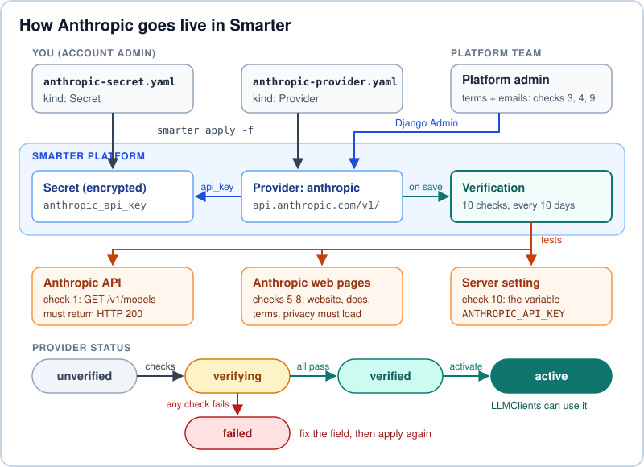

How-To: Add Anthropic (Claude) as an LLM Provider
=================================================

**Who this is for:** Smarter account admins at Northern Aurora Power & Light
(NAPL). **Time:** about 20 minutes.

This How-To connects **Anthropic** to Smarter. Anthropic is the company that
makes **Claude**. Claude models are the "brains" behind Claude Code. When you
finish, every NAPL team can choose a Claude model inside Smarter. Smarter also
keeps the API key safe and tracks who uses Claude and what it costs.

.. admonition:: In plain words

   Think of Smarter as a food court. Each LLM provider is a restaurant. A new
   restaurant cannot open until the manager checks the kitchen, the sign, the
   phone numbers and the rules. Smarter does the same job. It runs 10 checks
   before Anthropic can "open" for NAPL.

.. contents:: On this page
   :local:
   :depth: 1

Goal
----

Add a Provider named ``anthropic`` that is **verified** and **active**. After
that, any Smarter LLMClient can use Claude by saying ``provider: anthropic``.

.. note::

   **Claude Code or Claude?** Claude Code is Anthropic's coding tool. It runs
   in your terminal. The *models* do the thinking, for example Claude Opus 5.5
   (``claude-opus-5-5``) and Claude Sonnet 4.6 (``claude-sonnet-4-6``). So to
   "add Claude Code to Smarter", you add the **provider** (Anthropic) and its
   **models**. Programmers then reach the same Claude models from Smarter and
   from Claude Code.

Prerequisites
-------------

- You are a Smarter **account admin**. Smarter only lets admins apply
  Provider manifests.
- The **Smarter CLI** (command-line interface) is installed, and
  ``smarter whoami`` shows your NAPL account.
- NAPL has an organization in the
  `Claude Console <https://platform.claude.com/>`__, and you are allowed to
  create **API keys** there.
- The NAPL **platform team** (the people who run the Smarter servers) can help
  you with two admin-only jobs in Step 5.

Concept Overview
----------------

Words to know
~~~~~~~~~~~~~

LLM provider
   A company that runs large language models (LLMs) and lets programs use them
   over the internet. Anthropic is an LLM provider.

API key
   A secret password that a program sends with every request. It proves who is
   asking. Anthropic keys start with ``sk-ant-``.

Endpoint and base URL
   An endpoint is one web address that a program can call. The base URL is the
   part at the front of every endpoint, like a street name. Anthropic's base URL
   for Smarter is ``https://api.anthropic.com/v1/``.

Manifest
   A short YAML file that describes one Smarter resource. You send it to Smarter
   with ``smarter apply``, like handing a recipe card to the chef.

Secret
   A Smarter resource that keeps a password **encrypted** (scrambled), so people
   cannot read it.

Verification
   Smarter's automatic test bank. A Provider must pass every test before anyone
   can use it.

How it works
~~~~~~~~~~~~

         The Provider moves from unverified to verifying, verified and active.
   :width: 100%

   You apply two manifests. Smarter tests the Provider. When all 10 checks
   pass, the Provider becomes active.

Three facts explain the whole picture:

1. **The key lives in a Secret.** The Provider stores only the Secret's *name*.
   Nobody pastes the real key into a file that goes into Git.
2. **Smarter talks to Claude in the "OpenAI style".** Smarter's chat engine
   speaks the OpenAI Chat Completions format. Anthropic offers a matching
   endpoint at ``https://api.anthropic.com/v1/``. So Smarter can use Claude
   without any new code.
3. **The status is a gate.** A Provider's status moves from ``unverified`` to
   ``verifying`` to ``verified``. Then Smarter switches it on (**active**).
   LLMClients can only use an active Provider.

Step-by-Step
------------

Step 1: Create an Anthropic API key
~~~~~~~~~~~~~~~~~~~~~~~~~~~~~~~~~~~

1. Sign in to the Claude Console and open
   `API keys <https://platform.claude.com/settings/keys>`__.
2. Click **Create Key** and name it ``napl-smarter-provider``.
3. Copy the key once and keep it safe. The Console shows it only one time.

.. warning::

   Treat the key like a bank card PIN. Never put it in Git, chat or email.

Step 2: Save the key as a Smarter Secret
~~~~~~~~~~~~~~~~~~~~~~~~~~~~~~~~~~~~~~~~

Make a file named ``anthropic-secret.yaml`` in a folder **outside** any Git
repository. Put your real key in ``value``:

.. code-block:: yaml

   apiVersion: smarter.sh/v1
   kind: Secret
   metadata:
     name: anthropic_api_key
     description: Anthropic API key for the NAPL Smarter platform
     version: 1.0.0
   spec:
     config:
       expiration_date: "2027-10-01"
       value: sk-ant-REPLACE-ME

Send it to Smarter, check it, then delete the local file:

.. code-block:: console

   smarter apply -f anthropic-secret.yaml
   smarter describe secret anthropic_api_key

Smarter now keeps the key encrypted. The ``describe`` output never shows the
real value.

Step 3: Write the Provider manifest
~~~~~~~~~~~~~~~~~~~~~~~~~~~~~~~~~~~

Make a file named ``anthropic-provider.yaml``. This file is safe for Git,
because it holds no passwords:

.. code-block:: yaml

   apiVersion: smarter.sh/v1
   kind: Provider
   metadata:
     name: anthropic
     description: Anthropic Claude models for NAPL teams
     version: 1.0.0
     tags:
       - napl
       - claude
   spec:
     provider:
       name: anthropic
       description: Claude models from Anthropic for NAPL apps and coding pairs
       base_url: https://api.anthropic.com/v1/
       api_key: anthropic_api_key
       connectivity_test_path: /v1/models
       logo: https://raw.githubusercontent.com/smarter-sh/smarter/main/smarter/smarter/apps/provider/management/commands/data/logos/anthropic/anthropic-logo.svg
       website_url: https://www.anthropic.com/
       docs_url: https://platform.claude.com/docs/en/api/overview
       terms_of_service_url: https://www.anthropic.com/legal/commercial-terms
       privacy_policy_url: https://www.anthropic.com/legal/privacy
       contact_email: ai-platform@napl.example.com
       support_email: ai-help@napl.example.com

These are the data points Smarter needs, and why. Most of them feed one of the
10 checks in Step 5:

.. list-table::
   :header-rows: 1
   :widths: 30 70

   * - Field
     - What it does
   * - ``name``
     - The Provider's ID. LLMClients use it in ``provider: anthropic``. Use
       only letters, numbers and ``_``. It is case sensitive and must be
       unique. This is the only required field.
   * - ``description``
     - One short sentence that people see in Smarter.
   * - ``base_url``
     - Where Smarter sends Claude requests. This is Anthropic's
       OpenAI-compatible endpoint.
   * - ``api_key``
     - The **name** of the Secret from Step 2. It is not the key itself.
   * - ``connectivity_test_path``
     - Check 1. Smarter sends a ``GET`` here with the key and needs HTTP 200.
       Write the full path ``/v1/models``, because Smarter adds a ``/`` to the
       front, and a path that starts with ``/`` replaces the ``/v1/`` part of
       ``base_url``.
   * - ``logo``
     - Check 2. A picture link that ends in ``.png``, ``.jpg``, ``.jpeg`` or
       ``.svg``. The link above is the Anthropic logo that ships with Smarter.
   * - ``contact_email``
     - Check 3. The NAPL person or team that owns this Provider.
   * - ``support_email``
     - Check 4. Where NAPL people go for help.
   * - ``website_url``
     - Check 5. Anthropic's home page.
   * - ``terms_of_service_url``
     - Check 6. The page must contain the words "Terms of Service".
   * - ``docs_url``
     - Check 7. The page must contain the word "Documentation".
   * - ``privacy_policy_url``
     - Check 8. The page must contain the words "Privacy Policy".

Step 4: Apply the Provider and look at it
~~~~~~~~~~~~~~~~~~~~~~~~~~~~~~~~~~~~~~~~~

First do a **dry run**. It checks the manifest but changes nothing:

.. code-block:: console

   smarter apply -f anthropic-provider.yaml --dry-run
   smarter apply -f anthropic-provider.yaml
   smarter describe provider anthropic -o yaml

Saving the Provider starts the verification test bank. The status changes
from ``unverified`` to ``verifying``.

.. note::

   Smarter's docs mark the Provider app as "under active development".
   Smarter 0.17 and newer can create a new Provider from a manifest. If an
   older Smarter stops with "Failed to apply Provider", use the **platform
   shortcut** at the end of Step 5 instead, and keep the manifest in Git as
   the record of NAPL's settings.

Step 5: Pass the 10 checks
~~~~~~~~~~~~~~~~~~~~~~~~~~

Smarter runs these checks when you save the Provider. Each result stays valid
for 10 days, and Smarter runs them again on a schedule. If a check fails later,
for example because a web page moved, Smarter turns the Provider off. That
keeps every LLMClient safe.

.. list-table::
   :header-rows: 1
   :widths: 9 23 48 20

   * - #
     - Check
     - It passes when...
     - Who fixes it
   * - 1
     - API connectivity
     - ``GET`` on ``base_url`` + ``connectivity_test_path`` returns HTTP 200
     - You
   * - 2
     - Logo
     - ``logo`` is set and ends in ``.png``, ``.jpg``, ``.jpeg`` or ``.svg``
     - You
   * - 3
     - Contact email
     - ``contact_email`` is set **and** marked verified
     - Platform admin
   * - 4
     - Support email
     - ``support_email`` is set **and** marked verified
     - Platform admin
   * - 5
     - Website
     - ``website_url`` loads an HTML page (HTTP 200)
     - You
   * - 6
     - Terms of Service page
     - The page loads and contains "Terms of Service"
     - You
   * - 7
     - Docs page
     - The page loads and contains "Documentation"
     - You
   * - 8
     - Privacy policy page
     - The page loads and contains "Privacy Policy"
     - You
   * - 9
     - Terms accepted
     - A person accepted Anthropic's terms, and Smarter saved who and when
     - Platform admin
   * - 10
     - Production API key
     - The server setting ``ANTHROPIC_API_KEY`` is not empty
     - Platform team

Ask the platform team for the admin-only jobs:

- **Checks 3, 4 and 9:** in the Django Admin console, open
  **Providers > anthropic**. Fill in *Contact email verified*, *Support email
  verified*, *Tos accepted at* and *Tos accepted by*, then click **Save**.
  The same page lists every check result under *Provider verifications*.
- **Check 10:** add ``ANTHROPIC_API_KEY`` to the Smarter server settings and
  restart Smarter. The name comes from the Provider name in capital letters
  plus ``_API_KEY``.

.. tip::

   **Platform shortcut.** Anthropic is one of the official providers that
   Smarter can preload. When ``ANTHROPIC_API_KEY`` is set, the platform team can
   run ``python manage.py initialize_providers``. It creates the Secret, an
   already verified ``anthropic`` Provider and its models in one go. Smarter
   runs this command during automated deployments.

Step 6: Add the Claude models
~~~~~~~~~~~~~~~~~~~~~~~~~~~~~

Smarter keeps a list of each provider's models, called **ProviderModels**. The
platform shortcut fills this list from ``GET https://api.anthropic.com/v1/models``.
For a Provider that you applied yourself, add models in the Django Admin console
under **Provider models > Add**. Start with these:

.. list-table::
   :header-rows: 1
   :widths: 28 72

   * - Model ID
     - Use it for
   * - ``claude-sonnet-4-6``
     - The default for Smarter LLMClients. It is also Smarter's built-in default
       Anthropic model.
   * - ``claude-haiku-4-5``
     - Quick, low-cost jobs such as sorting or short summaries.
   * - ``claude-opus-5-5``
     - Hard problems. Programmers use it in Claude Code with ``/model``.

.. important::

   Smarter sends each LLMClient's ``defaultTemperature`` with every chat
   request. Claude Opus 4.7 and newer models, such as Claude Opus 5.5 and
   Claude Sonnet 5.5, refuse any temperature below 1 with an HTTP 400 error.
   So use ``defaultTemperature: 1.0`` with them. Smarter's own example
   manifests use 1.0 too. Older models, such as ``claude-sonnet-4-6`` and
   ``claude-haiku-4-5``, accept any value from 0 to 1. Claude Code chooses its
   own settings, so it can use any Claude model.

Proof of Concept
----------------

Run this command. The ``-o yaml`` flag prints YAML instead of JSON:

.. code-block:: console

   smarter describe provider anthropic -o yaml

You are done when the ``status`` part of the output shows both flags as true:

.. code-block:: yaml

   status:
     isActive: true
     isVerified: true

The Provider also appears in ``smarter get providers``. Next, follow
:doc:`napl-getting-started-claude-code-simonhua` to build a Claude-powered
LLMClient on top of it.

Troubleshooting
---------------

.. list-table::
   :header-rows: 1
   :widths: 34 66

   * - What you see
     - What to do
   * - "Only account admins can apply provider manifests."
     - Ask a NAPL Smarter account admin to apply the manifest, or to give you
       the admin role.
   * - "Failed to apply Provider ... Secret anthropic_api_key not found"
     - Apply the Secret from Step 2 first. The ``api_key`` field must use the
       same name as the Secret.
   * - "Failed to apply Provider" (no Secret message)
     - Smarter versions before 0.17 cannot create a new Provider from a
       manifest. Ask the platform team to upgrade Smarter, or to use the
       platform shortcut in Step 5.
   * - "Provider name ... must contain only letters, numbers and underscores"
     - Use ``anthropic``. Dashes and spaces are not allowed.
   * - "Invalid ... URL"
     - Every link needs the full ``https://`` part.
   * - Status is ``failed`` because of check 1
     - Test the same address yourself with the command below. A 401 means the
       key is wrong. A 404 means the path is wrong. No answer at all means a
       firewall blocks ``api.anthropic.com``.
   * - Status is ``failed`` because of checks 5 to 8
     - Open each link in a browser. If a page moved or lost its key words, use
       a new link and apply the manifest again.
   * - Error "Production API key ... not set in environment variables"
     - ``ANTHROPIC_API_KEY`` is missing on the server (check 10). Ask the
       platform team.
   * - Status stays ``verifying``
     - The background workers (Celery) may be stopped. Ask the platform team.
   * - Status is ``verified`` but not active
     - The terms are not accepted yet (check 9). See Step 5.
   * - An LLMClient fails with HTTP 400 about ``temperature``
     - Newer Claude models refuse temperatures below 1. Set
       ``defaultTemperature: 1.0`` in the LLMClient manifest, or switch to
       ``claude-sonnet-4-6``.

Test the connection the same way Smarter does:

.. code-block:: console

   curl -i https://api.anthropic.com/v1/models -H "Authorization: Bearer $ANTHROPIC_API_KEY"

In Windows PowerShell, type ``curl.exe`` instead of ``curl`` and use
``$env:ANTHROPIC_API_KEY``. The first line of the answer should say ``200``.

Learn More
----------

- `Smarter Provider reference <https://docs.smarter.sh/smarter-resources/smarter-provider.html>`__
- `Claude API overview <https://platform.claude.com/docs/en/api/overview>`__
- `OpenAI SDK compatibility in the Claude API <https://platform.claude.com/docs/en/cli-sdks-libraries/libraries/openai-sdk>`__
- `Claude models overview <https://platform.claude.com/docs/en/models/overview>`__
